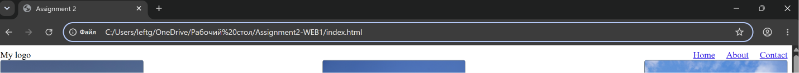
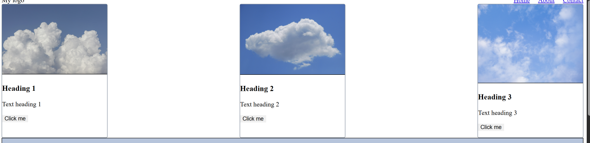
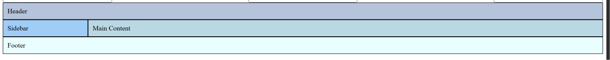
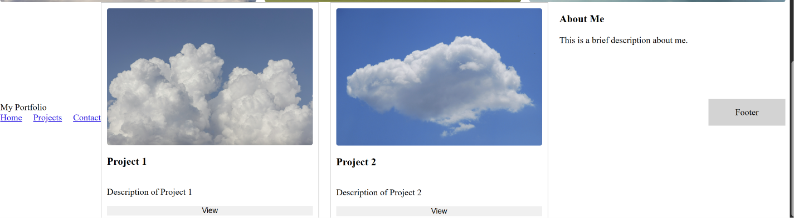

# Assignment #2 — Advanced CSS (Flexbox & Grid)

**Name:** Ingkar Tolegen

**Group:** SE-2540

**GitHub repository:** [https://github.com/InkarTolegen2/Assignment2-WEB1.git](https://github.com/InkarTolegen2/Assignment2-WEB1.git)

**URL:**[file:///C:/Users/leftg/OneDrive/%D0%A0%D0%B0%D0%B1%D0%BE%D1%87%D0%B8%D0%B9%20%D1%81%D1%82%D0%BE%D0%BB/Assignment2-WEB1/index.html](file:///C:/Users/leftg/OneDrive/%D0%A0%D0%B0%D0%B1%D0%BE%D1%87%D0%B8%D0%B9%20%D1%81%D1%82%D0%BE%D0%BB/Assignment2-WEB1/index.html)

## Tasks

### Task 0. Navigation Bar
Created a flex navbar with logo on the left and links on the right, vertically centered.

### Task 1. Card Row
Created a row of 3 flex cards with image, title, text, button, equal height, gap, and hover effect.

### Task 2. Page Layout with Grid Areas
Built a grid layout with header, sidebar, main content, and footer using grid-template-areas.

### Task 3. Image Gallery
Created a 3-column grid gallery with 9 images, consistent gaps, and hover caption overlay.

### Task 4. Portfolio Page
Combined Flexbox (header nav, project card content) and Grid (main layout: projects + sidebar) into one portfolio page.

## Summary
In this assignment,  I practiced CSS Flexbox  and Grid layout techniques.  I built a navigation bar and card row using Flexbox,  a page layout and image gallery using Grid,  and combined both systems on a portfolio page.  I learned how to align items,  control spacing with gap, create responsive column/row structures,  and add hover effects using transitions and opacity.